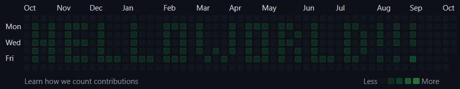

# GitHub's contributions calendar writer

This is a simple tool that commits to a GitHub repository every day, so that
the contributions calendar is filled with green squares to write a message.

## Usage

### As a GitHub action

Create a new GitHub repository and install the following GitHub action

    name: Github contributions calendar writer
    
    on:
      workflow_dispatch:
      schedule:
        - cron: '0 8 * * *'
    
    jobs:
      run_calendar_writer:
        runs-on: ubuntu-latest
        name: Run calendar writer
        steps:
          - uses: "actions/checkout@v3"
            with:
              fetch-depth: 0
          - name: Run the local calendar writer action
            uses: Wawa27/github-contributions-calendar-writer@latest
            with:
              text: YOUR_MESSAGE
              actorName: YOUR_GITHUB_NAME
              actorEmail: YOUR_GITHUB_EMAIL

This GitHub action will commit to the repository every day at 8am UTC to display the specified message on the
contributions calendar.

### As a local script (WIP, not working yet)

You can also run the script locally.

    $ git clone https://github.com/Wawa27/github-contributions-calendar-writer
    $ cd github-contributions-calendar-writer
    $ npm install
    $ npm run build
    $ npm run start "Hello world" "YOUR_GITHUB_NAME" "YOUR_GITHUB_EMAIL"
